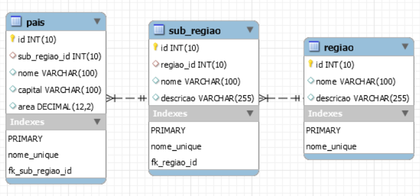

# RestAPI-2ibi
Representational State Transfer (REST), em português Transferência Representacional de Estado, é um estilo de arquitetura de software que define um conjunto de restrições a serem usadas para a criação de web services (serviços Web). Os Web services que estão em conformidade com o estilo arquitetural REST, denominados Web services RESTful, fornecem interoperabilidade entre sistemas de computadores na Internet.
Os Web services RESTful permitem que os sistemas solicitantes acessem e manipulem representações textuais de recursos da Web usando um conjunto uniforme e predefinido de operações sem estado. Outros tipos de Web services, como Web services SOAP, expõem seus próprios conjuntos de operações arbitrários.

# Objectivos
Desenvolver uma API RESTful que permita gerenciar as informações das propriedades dos países (identificador – gerado automaticamente, nome, capital, região, sub-região, área).

* Criar um novo país a partir da API criada com todas as suas propriedades;
* Listar todos os países, sub-regiões ou regiões anteriormente criados;
* Modificar os dados de um país, uma sub-região ou região anteriormente criado;
* Eliminar um país, uma sub-região ou região anteriormente criado;
* Ordenar a lista dos países, sub-regiões ou regiões por qualquer uma das suas propriedades;
* Restringir a pesquisa da lista de países por qualquer uma das suas propriedades;
* Obter um país, uma sub-região ou região em específico pelo identificador.

Para o maior desempenho e integridade da base de dados foi criado duas tabelas extra para o armazenamento de região, e sub-região respectivamente, ilustrado a seguir:



# Requisitos
1. Java 8
2. JDK 1.8
3. Tomcat 8
4. Mysql

# Instalação
1. Clone o repositório
```
  git clone https://github.com/Guirande/RestAPI-2ibi.git
```
2. Altere as propriedades do ficheiro `db.properties` do pacote `tk.meceap.db.dao` para a conexao com a base de dados.
    *A aplicação se encarregará de criar a base de dados e respetivas tabelas;*
3. Faça a implantação/deploy da aplicação clonada para testes locais;
4. Faça (limpar e construir)/(clean and building) para obter o arquivo `.war`, arquivo que será usado no gerenciador de servidor tomcat em ambiente de produção;
5. Faça o upload do arquivo `.war` da pasta `/dist` do projecto para o servidor tomcat.

# Teste da aplicação
Para testes encontra-se disponível os seguintes endereços:
```
http://meceap.tk:8084/RestAPI-2ibi/api/regiao/
http://meceap.tk:8084/RestAPI-2ibi/api/sub-regiao/
http://meceap.tk:8084/RestAPI-2ibi/api/pais/
```

## Região

### OBTER Lista de Regiões  (GET)
```
http://meceap.tk:8084/RestAPI-2ibi/api/regiao/all
```

#### Response
```
[
  {
    "id": 1,
    "nome": "África",
    "descricao": "Continente situado no centro do planeta"
  },
  {
    "id": 2,
    "nome": "Ásia",
    "descricao": "Continente situado no sudeste do planeta"
  },
  {
    "id": 4,
    "nome": "Europa",
    "descricao": "Continente situado no sudeste do planeta"
  }
]
```

### OBTER Região pelo identificador (GET)

```
http://meceap.tk:8084/RestAPI-2ibi/api/regiao/{id}
```

#### Response
```
{
  "id": 1,
  "nome": "África",
  "descricao": "Continente situado no centro do planeta"
}
```

### ADICIONAR Região (POST)

```
http://meceap.tk:8084/RestAPI-2ibi/api/regiao/
```

#### Request Body
```
{
    "nome": "Europa",
    "descricao": "Continente situado no sudeste do planeta"
}
```

#### Response
```
{
    "id": 1,
    "nome": "Europa",
    "descricao": "Continente situado no sudeste do planeta"
}
```

### ACTUALIZAR a Região (PUT)

```
http://meceap.tk:8084/RestAPI-2ibi/api/regiao/{id}
```

#### Request Body
```
{
    "id": 1,
    "nome": "Europas",
    "descricao": "Continente situado no sudeste do planeta"
}
```

#### Response
```
{
  "status": "true"
}
```

### ELIMINAR a Região (DELETE)

```
http://meceap.tk:8084/RestAPI-2ibi/api/regiao/{id}
```

#### Response
```
{
  "status": "true"
}
```


## Sub Região

### OBTER Lista de Sub Regiões (GET)
```
http://meceap.tk:8084/RestAPI-2ibi/api/sub-regiao/all
```

#### Response
```
[
  {
    "id": 1,
    "regiaoId": 1,
    "nome": "África Austral",
    "descricao": "Região de sul da África",
    "regiao": {
      "id": 1,
      "nome": "Áfricas",
      "descricao": "Continente situado no centro do planeta"
    }
  },
  {
    "id": 2,
    "regiaoId": 2,
    "nome": "Chinna",
    "descricao": "Regiao de sul da Asia",
    "regiao": {
      "id": 2,
      "nome": "Ásia",
      "descricao": "Continente situado no sudeste do planeta"
    }
  },
  {
    "id": 4,
    "regiaoId": 2,
    "nome": "Paises baixos",
    "descricao": "Regiao de sul da Europa",
    "regiao": {
      "id": 2,
      "nome": "Ásia",
      "descricao": "Continente situado no sudeste do planeta"
    }
  }
]
```

### OBTER a Sub Região pelo identificador (GET)

```
http://meceap.tk:8084/RestAPI-2ibi/api/sub-regiao/{id}
```

#### Response
```
{
  "id": 1,
  "regiaoId": 1,
  "nome": "África Austral",
  "descricao": "Região de sul da África",
  "regiao": {
    "id": 1,
    "nome": "Áfricas",
    "descricao": "Continente situado no centro do planeta"
  }
}
```

### ADICIONAR a Sub Região (POST)

```
http://meceap.tk:8084/RestAPI-2ibi/api/sub-regiao/
```

#### Request Body
```
{
  "regiaoId": 1,
  "nome": "África Austral",
  "descricao": "Região de sul da África"
}
```

#### Response
```
{
  "id": 1,
  "regiaoId": 1,
  "nome": "África Austral",
  "descricao": "Região de sul da África",
  "regiao": {
    "id": 1,
    "nome": "Áfricas",
    "descricao": "Continente situado no centro do planeta"
  }
}
```

### ACTUALIZAR a Sub Região (PUT)

```
http://meceap.tk:8084/RestAPI-2ibi/api/sub-regiao/{id}
```

#### Request Body
```
{
    "id": 1,
    "regiaoId": 1,
    "nome": "África Austral",
    "descricao": "Região de sul da África"
}
```

#### Response
```
{
  "status": "true"
}
```

### ELIMINAR a Sub Região (DELETE)

```
http://meceap.tk:8084/RestAPI-2ibi/api/sub-regiao/{id}
```

#### Response
```
{
  "status": "true"
}
```

## PAÍS
### OBTER Lista de PAÍSES (GET)
```
http://meceap.tk:8084/RestAPI-2ibi/api/pais/all
```

#### Response
```
[
  {
    "id": 1,
    "subRegiaoId": 1,
    "nome": "Mozambique",
    "capital": "Chimoio",
    "area": 2938.43,
    "subRegiao": {
      "id": 1,
      "regiaoId": 1,
      "nome": "África Austral",
      "descricao": "Região de sul da África",
      "regiao": {
        "id": 1,
        "nome": "Áfricas",
        "descricao": "Continente situado no centro do planeta"
      }
    }
  }
]
```


### OBTER Lista de PAÍSES pela pesquisa ordenada ou cláusula where (POST)
```
http://meceap.tk:8084/RestAPI-2ibi/api/pais/query
```

#### Request Body
```
{"query":"order:nome ASC;where:capital='Maputo'"}
```
#### Response
```
[
  {
    "id": 1,
    "subRegiaoId": 1,
    "nome": "Mozambique",
    "capital": "Chimoio",
    "area": 2938.43,
    "subRegiao": {
      "id": 1,
      "regiaoId": 1,
      "nome": "África Austral",
      "descricao": "Região de sul da África",
      "regiao": {
        "id": 1,
        "nome": "Áfricas",
        "descricao": "Continente situado no centro do planeta"
      }
    }
  }
]
```

### OBTER PAÍS (GET)

```
http://meceap.tk:8084/RestAPI-2ibi/api/pais/{id}
```

#### Response
```
{
  "id": 1,
  "subRegiaoId": 1,
  "nome": "Mozambique",
  "capital": "Maputo",
  "area": 2938.43,
  "subRegiao": {
    "id": 1,
    "regiaoId": 1,
    "nome": "África Austral",
    "descricao": "Região de sul da África",
    "regiao": {
      "id": 1,
      "nome": "Áfricas",
      "descricao": "Continente situado no centro do planeta"
    }
  }
}
```

### ADICIONAR PAÍS (POST)

```
http://meceap.tk:8084/RestAPI-2ibi/api/pais/
```

#### Request Body
```
{
  "subRegiaoId": 1,
  "nome": "Mozambique",
  "capital": "Maputo",
  "area": 2938.43
}
```

#### Response
```
{
  "id": 1,
  "subRegiaoId": 1,
  "nome": "Mozambique",
  "capital": "Maputo",
  "area": 2938.43,
  "subRegiao": {
    "id": 1,
    "regiaoId": 1,
    "nome": "África Austral",
    "descricao": "Região de sul da África",
    "regiao": {
      "id": 1,
      "nome": "Áfricas",
      "descricao": "Continente situado no centro do planeta"
    }
  }
}
```

### ACTUALIZAR PAÍS (PUT)

```
http://meceap.tk:8084/RestAPI-2ibi/api/pais/{id}
```

#### Request Body
```
{
  "subRegiaoId": 1,
  "nome": "Mozambique",
  "capital": "Chimoio",
  "area": 2938.43
}
```

#### Response
```
{
  "status": "true"
}
```

### ELIMINAR PAÍS (DELETE)

```
http://meceap.tk:8084/RestAPI-2ibi/api/pais/{id}
```

#### Response
```
{
  "status": "true"
}
```
